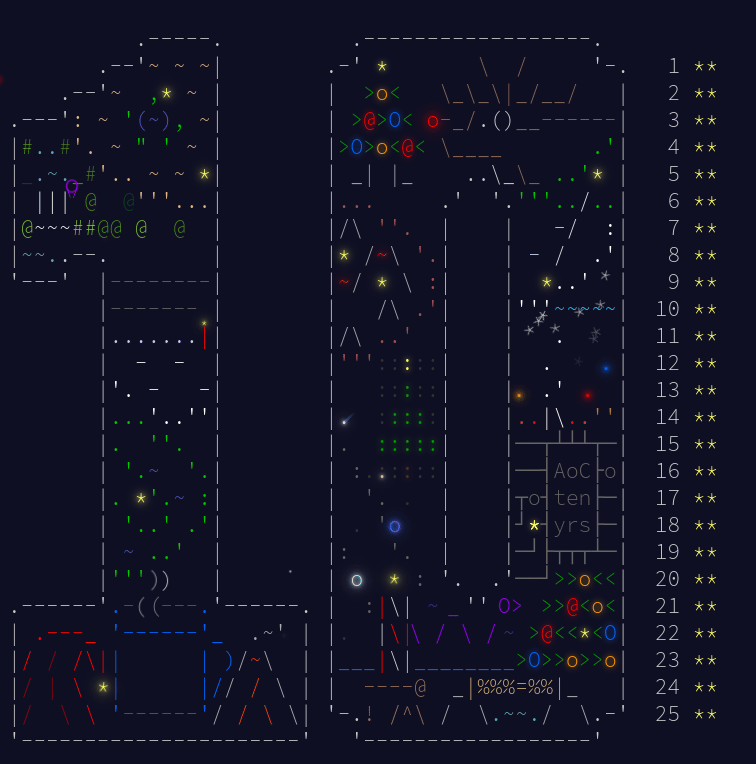

# Advent of Code 2024 in C 🎄

This repo contains my solutions to all AOC 2024 problems! Since this is the first time I'm doing AOC I decided to do it in C.

Libraries I used: *uthash* and *z3 (for day17 part 2)*

##### Merry Christmas and enjoy :D

### Small todo for me:
- Optimize Day 6 part 2 (has 10 min runtime on my device ;-;)
- Make a general day 17 part 2 solution
